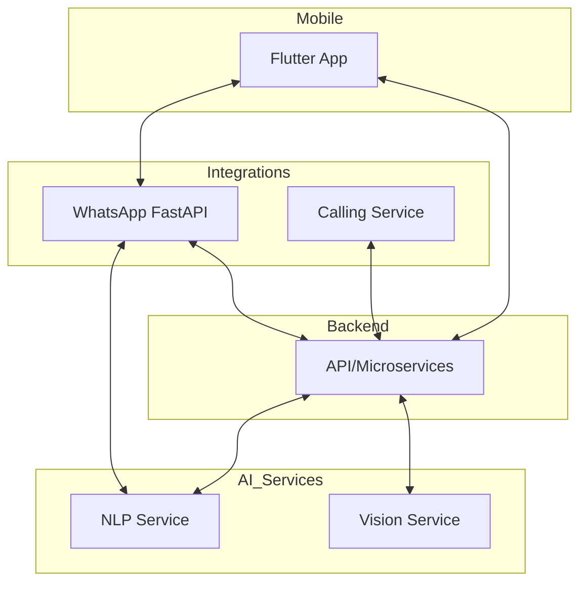

# Nagar Setu Monorepo


---

## 🗺️ Architecture Overview



A unified platform for civic issue reporting, AI-powered analysis, and multi-channel citizen engagement.

---

## 🗂️ Monorepo Structure

```
Nagar_Setu/
├── backend/                  # (Reserved for backend API/microservices)
├── ai-services/
│   ├── nlp-service/          # NLP model, training, and inference
│   └── vision-service/       # Computer vision (pothole detection, etc.)
├── integrations/
│   ├── whatsapp/             # WhatsApp/FastAPI app for citizen interaction
│   └── calling/              # Voice/call integration (Twilio, etc.)
└── mobile/
    └── app/                  # (Flutter/mobile app placeholder)
```

---

## 🚀 Quick Start

1. **Clone the repo:**
   ```bash
   git clone https://github.com/vedamehar/Nagar_Setu.git
   cd Nagar_Setu
   ```
2. **Set up Python environment:**
   ```bash
   python -m venv venv
   source venv/bin/activate  # or venv\Scripts\activate on Windows
   pip install -r integrations/whatsapp/requirements.txt
   pip install -r ai-services/nlp-service/nlp_model/requirements.txt
   pip install -r ai-services/vision-service/requirements.txt
   pip install -r integrations/calling/requirements.txt
   ```
3. **Environment variables:**
   - Copy `.env.example` to `.env` and fill in secrets (Twilio, Firebase, etc.)

4. **Run WhatsApp/FastAPI server:**
   ```bash
   cd integrations/whatsapp
   uvicorn main:app --reload --port 8000
   ```

5. **Run NLP or Vision services:**
   ```bash
   # NLP
   cd ../../ai-services/nlp-service/nlp_model
   python train_nlp.py  # or infer_nlp.py

   # Vision
   cd ../../vision-service
   python train.py  # or infer.py
   ```

---

## 🤖 Features
- WhatsApp chatbot for citizen complaints
- AI-powered NLP for complaint classification
- Computer vision for pothole/image analysis
- Voice/call integration (Twilio)
- Modular, scalable monorepo structure

---

## 🛠️ Development
- All Python code is in service folders (see above)
- Mobile app (Flutter) will be added to `mobile/app/`
- Datasets and large files are ignored by `.gitignore`
- Use sample data for local testing; full datasets via external links

---

## 🧑‍💻 Contributing
1. Fork the repo and create a feature branch
2. Follow the monorepo structure for new services
3. Submit a pull request with clear description

---

## 📁 Data & Models
- Large datasets and model weights are not tracked in git
- Use provided scripts to download or link data as needed

---

## 📞 Contact & Support
- Raise issues via GitHub or contact the maintainer

---

> Nagar Setu: Bridging citizens and civic authorities with AI and modern tech.
